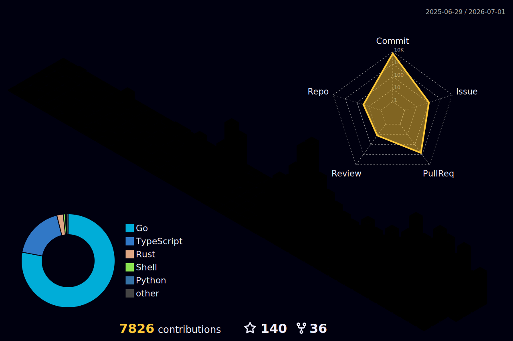

<table border="0">
<tr>
<td width="200" valign="top">

</td>
<td valign="top">

> building cozy AI systems & low-level toys
> GPU kernels · eBPF · MEV · sci-fi anime · レイヤー

</td>
<td width="320" valign="top">

</td>
</tr>
</table>

<table border="0">
<tr>
<td>

</td>
<td>

</td>
</tr>
</table>

